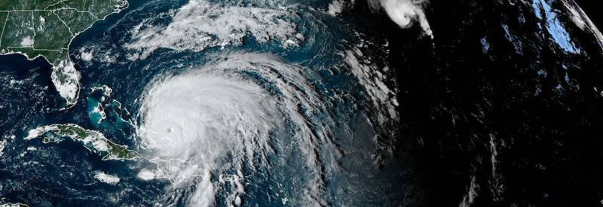

# Interactive Geospatial Visualization of Disasters Using FEMA Dataset on R Shiny

## Project Overview

This R Shiny application provides an interactive geospatial visualization of disasters using data from the Federal Emergency Management Agency (FEMA). The project was developed as a team effort at Columbia University in Fall 2023.



[Access the R Shiny Application](https://dj3tzj-ritika-nandi.shinyapps.io/ADS-Fall2023-Project2-Group9/)

## Application Features

The application leverages open datasets from FEMA, encompassing approximately 465,000 records, to provide historical data on disaster occurrences and associated economic impacts. Key components include:

1. County-level Disaster Map
2. Economic Impact Analysis
3. Disaster Frequency Visualization

### 1. County-level Disaster Map

This module utilizes FEMA data to display disaster counts by state, county, and year across the United States. Users can select specific geographic and temporal parameters to view disaster frequencies. The map rendering may take 1-6 minutes depending on network and system resources.

A supplementary bar plot visualization is provided, illustrating disaster counts for the selected parameters, including a breakdown by disaster category.

### 2. Economic Impact Analysis

This section estimates the financial implications of disasters using historical insurance claim data. It provides:

- Average cost of disasters
- Estimated FEMA support for disaster mitigation

### 3. Disaster Frequency Visualization

A word cloud visualization represents the most frequent disasters in the selected state and year. The size of each word corresponds to the relative frequency of the disaster type, offering a quick visual summary of common disaster occurrences.

## Project Structure

The repository is organized as follows:

```
proj/
├── app/
│   ├── data/
│   ├── reconnect/
│   └── www/
└── doc/
    └── figs/
```

Please refer to the README files in each subdirectory for detailed information.

## Contributions

This project was completed by a team of 5 members. All team members contributed equally to all stages of this project. The team unanimously approves the work presented in this GitHub repository, including this contribution statement.
